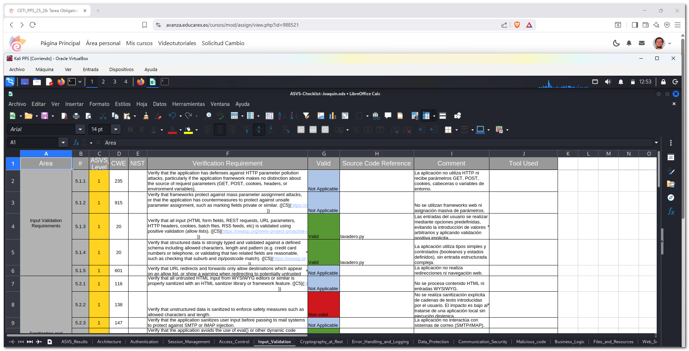

# 3. Comprobación de los requisitos de seguridad de la aplicación (OWASP ASVS)

En esta práctica se ha aplicado el estándar **OWASP Application Security Verification Standard (ASVS)** con el objetivo de comprobar los requisitos de seguridad de la aplicación desarrollada en Python durante la unidad anterior.

La verificación se ha centrado en los capítulos indicados en la actividad:

- **Capítulo 5: Validación de entrada**
- **Capítulo 10: Código malicioso**

El análisis se ha realizado mediante revisión manual del código fuente y apoyándose en herramientas automáticas de análisis estático.

---

## 3.1 Descripción de la aplicación y nivel de seguridad ASVS

La aplicación que se analiza es la de la unidad anterior, una **aplicación local de consola desarrollada en Python**, cuyo objetivo es simular el funcionamiento de un lavadero automático.

Se trata de una aplicación sin interfaz web, sin comunicaciones de red y sin acceso a bases de datos. La interacción con el usuario se realiza exclusivamente mediante la introducción de opciones por consola, guiadas por el propio flujo de la aplicación.

Debido a estas características, la aplicación no está expuesta a Internet ni gestiona información sensible, por lo que el **nivel de seguridad requerido es ASVS Nivel 1**, adecuado para aplicaciones sencillas y de uso local.

---

## 3.2 Validación de entrada (Input_Validation)

El capítulo de validación de entrada del estándar ASVS está orientado principalmente a aplicaciones web que procesan datos procedentes de formularios, peticiones HTTP o servicios externos. En el caso de la aplicación analizada, muchos de los requisitos definidos en este capítulo no son aplicables debido a su naturaleza local.

La aplicación no recibe parámetros GET o POST, no utiliza cookies, cabeceras HTTP ni variables de entorno, y no procesa datos estructurados complejos como HTML, JSON o XML. Tampoco se realizan redirecciones, ni se utilizan plantillas dinámicas o motores de renderizado.

Las entradas del usuario se realizan mediante **opciones predefinidas mostradas por consola**, lo que limita los valores posibles y evita la introducción de datos arbitrarios. Este enfoque permite aplicar **validación positiva (allow lists)** de forma implícita, ya que el usuario solo puede seleccionar entre las opciones previstas por la lógica del programa.

Asimismo, la aplicación no utiliza mecanismos de ejecución dinámica de código como `eval()`, ni realiza llamadas al sistema operativo basadas en datos introducidos por el usuario. Esto reduce significativamente los riesgos asociados a inyecciones de código, inyección de comandos o ejecución no controlada.

En consecuencia, los controles ASVS relacionados con validación positiva, tipado de datos y prevención de inyecciones se consideran cumplidos, mientras que aquellos orientados a entornos web o a la sanitización de formatos complejos se consideran no aplicables.

---

## 3.3 Código malicioso (Malicious_code)

Para la comprobación de los requisitos relacionados con la detección de código malicioso se ha utilizado una **herramienta de análisis estático de seguridad** específica para aplicaciones Python.

La herramienta empleada ha sido **Bandit**, desarrollada por OpenStack, que permite identificar patrones de código potencialmente peligrosos, como el uso inseguro de funciones del sistema, ejecución dinámica de código, lógica maliciosa, puertas traseras o funcionalidades ocultas.

Se ha ejecutado Bandit sobre los archivos principales de la aplicación (`main_app.py` y `lavadero.py`), no detectándose ningún problema de seguridad ni indicios de código malicioso.

Este resultado permite verificar el cumplimiento de los controles ASVS relacionados con:

- El uso de herramientas de análisis de código.
- La ausencia de puertas traseras o cuentas embebidas.
- La inexistencia de lógica maliciosa o bombas de código.
- La ausencia de funcionalidades ocultas o no documentadas.
- El uso seguro de funciones del sistema y del lenguaje.

---

## 3.4 Uso de herramientas automáticas de análisis

Además de la revisión manual del código fuente, se ha utilizado una herramienta automática para apoyar la verificación de los requisitos ASVS.

Bandit ha permitido comprobar de forma objetiva y automatizada varios controles relacionados con código malicioso y ejecución insegura, reforzando los resultados obtenidos durante el análisis manual.

El uso de este tipo de herramientas facilita la detección temprana de problemas de seguridad y complementa la revisión manual del código, especialmente en aplicaciones desarrolladas en Python.

---

## 3.5 Análisis del grado de cobertura ASVS

El gráfico de cobertura incluido en la hoja de cálculo OWASP ASVS checklist muestra un número elevado de controles marcados como *Not Applicable*. Este resultado es coherente con el tipo de aplicación analizada.

El estándar ASVS está diseñado principalmente para aplicaciones web con mayor complejidad y exposición, por lo que muchos de sus controles no aplican a aplicaciones locales sencillas como la analizada.

Los controles aplicables han sido verificados correctamente, obteniéndose una cobertura adecuada para el nivel de seguridad requerido.

[ASVS-Checklist-Joaquin.ods](https://github.com/JBLeopard/Unidad2-TareaRA2-Joaquin/blob/main/docs/ASVS-Checklist-Joaquin.ods)

---

## 3.6 Valoración del estándar OWASP ASVS

OWASP ASVS es un estándar muy completo que permite estructurar y documentar la verificación de seguridad de una aplicación de forma sistemática.

Aunque puede resultar extenso para aplicaciones pequeñas o locales, facilita la identificación de los requisitos realmente aplicables y permite justificar de forma clara aquellos que no lo son.

Su aplicación contribuye a mejorar la comprensión de los requisitos de seguridad y proporciona una base sólida para el desarrollo de aplicaciones más seguras.

---
