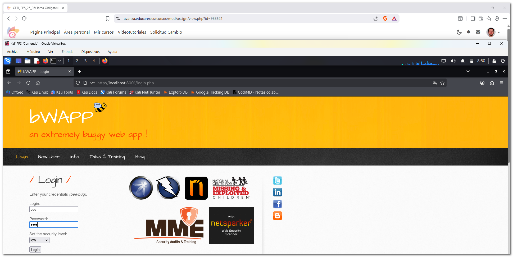
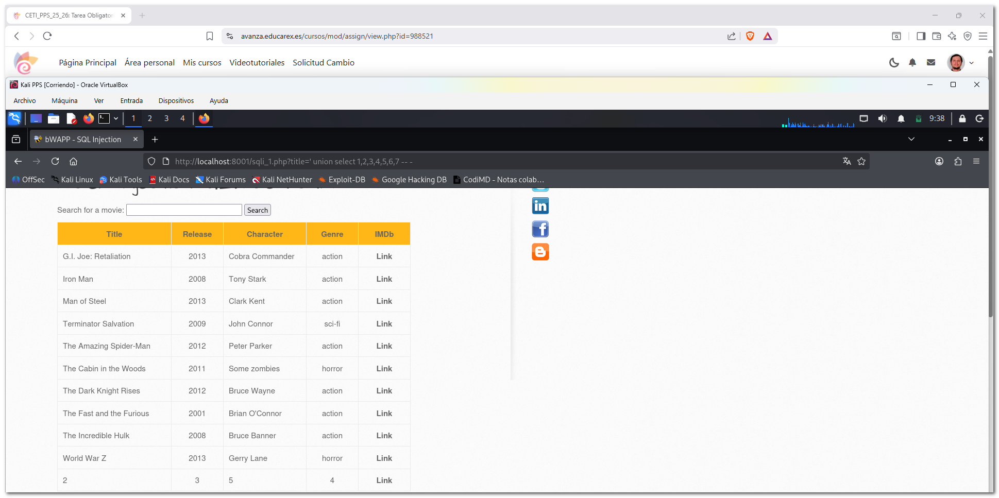
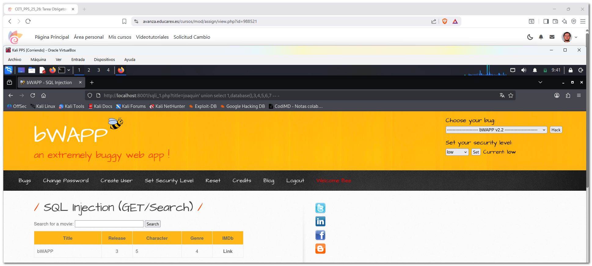
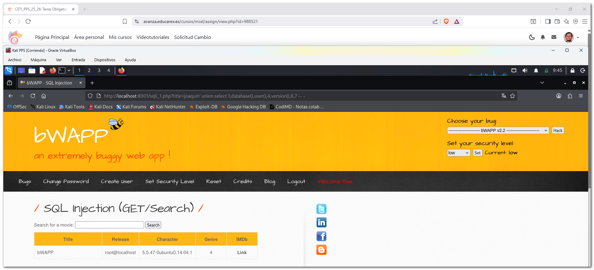
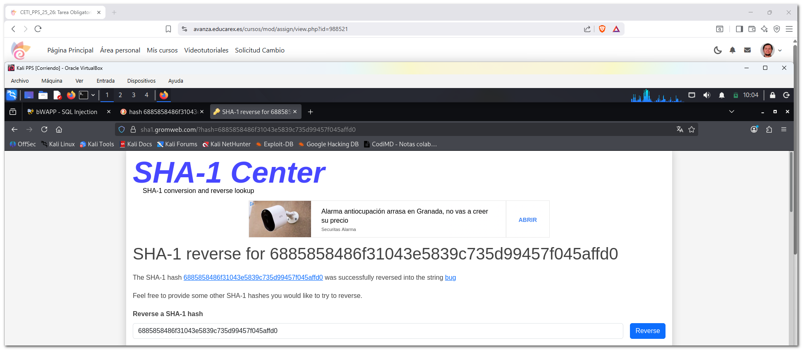

# 2. Documentación de la explotación y securización de la vulnerabilidad

En esta práctica se ha trabajado con un entorno de máquinas vulnerables y se ha realizado un **test de intrusión** explotando una vulnerabilidad de **SQL Injection** en la aplicación bWAPP.  
En esta documentación se proponen los siguientes objetivos:  

- Conocer distintos proyectos de máquinas vulnerables para prácticas de seguridad.  
- Utilizar un entorno controlado para la realización de pruebas de intrusión.  
- Identificar y explotar una vulnerabilidad de tipo SQL Injection.  
- Analizar el código fuente responsable de la vulnerabilidad.

Para la realización de esta actividad se han puesto en marcha varios contenedores con docker que forman un entorno de pruebas con aplicaciones web vulnerables.

---

## 2.1 DVWA (Damn Vulnerable Web Application)

DVWA es una aplicación web deliberadamente vulnerable que permite practicar distintos tipos de ataques web, como inyección SQL, XSS, CSRF, entre otros.  
Se accede a través del navegador y permite configurar distintos niveles de seguridad.  
**Acceso:**
- URL: http://localhost:8002
- Usuario: admin
- Contraseña: password

En el primer acceso es necesario crear la base de datos antes de poder comenzar con las pruebas.


---

### 2.2 OWASP Multillidae II

OWASP Multillidae II es otra aplicación web vulnerable mantenida por OWASP que permite entrenar en distintos escenarios de ataque.  
**Acceso:**
- URL: http://localhost  
- PhpMyAdmin: http://localhost:81  
- PhpLdapAdmin: http://localhost:82  

No es necesario usuario ni contraseña para acceder a la aplicación principal.ye servicios adicionales como acceso a bases de datos y servicios LDAP.  


---

### 2.3 Kali Linux

Kali Linux se incluye como máquina de apoyo para la realización de pruebas de seguridad, utilizando herramientas de análisis y test de intrusión sobre el resto de aplicaciones.

**Acceso:**  
- Kali Linux se utiliza como máquina de apoyo para realizar pruebas de seguridad sobre el resto de aplicaciones.  
- El acceso se realiza mediante terminal, utilizando herramientas de análisis y test de intrusión.  
```bash
docker exec -it kali /bin/bash
```


---

### 2.4 bWAPP (Buggy Web Application)

bWAPP es una aplicación web vulnerable que contiene más de 100 vulnerabilidades diferentes, orientadas al aprendizaje de seguridad web.  
Incluye vulnerabilidades de inyección, autenticación, gestión de sesiones y validación de entradas, entre otras.  

**Acceso:**
- URL: http://localhost:8001
- Usuario: bee
- Contraseña: bug

En el primer acceso es necesario crear la base de datos desde la página de instalación antes de poder acceder a la aplicación.














---
