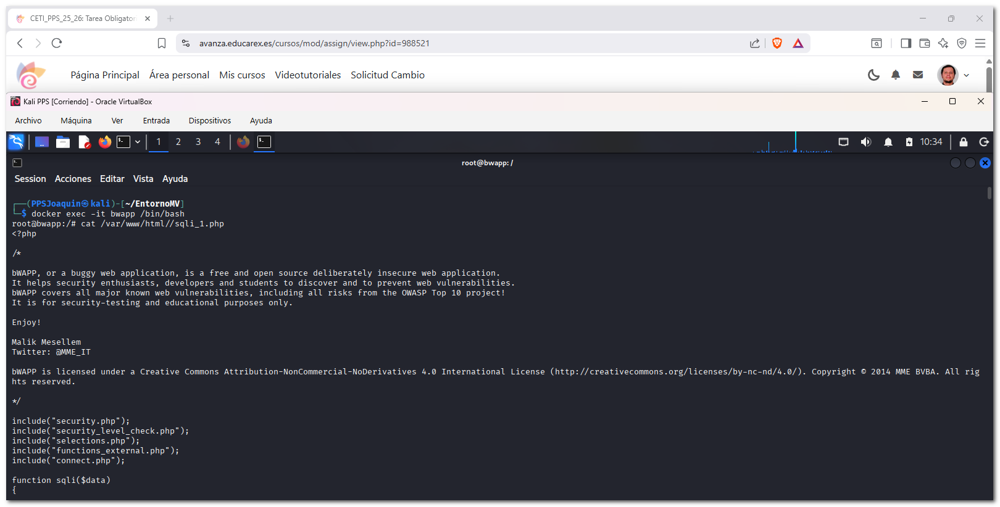
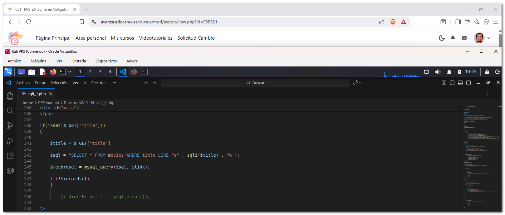
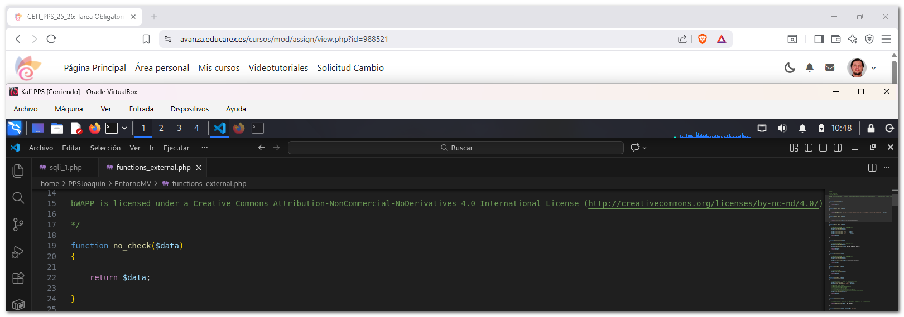
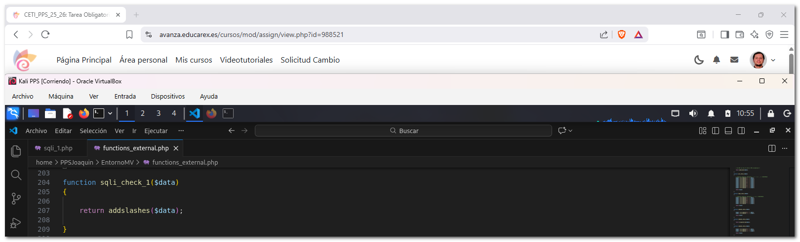
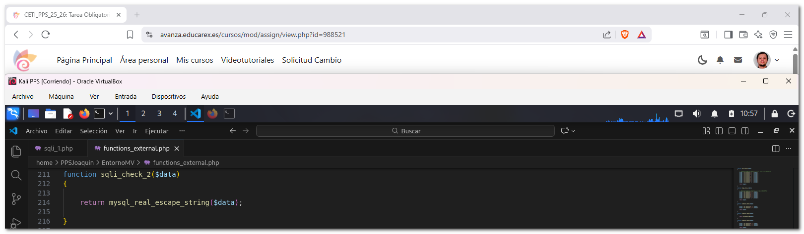
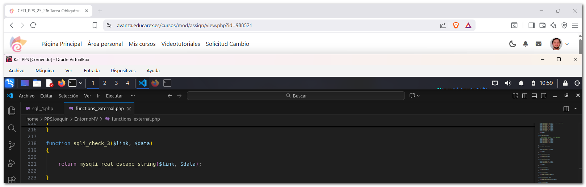
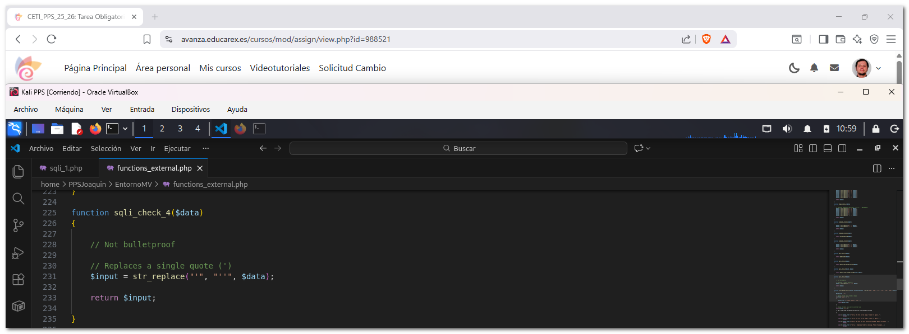

# 2. Documentación de la explotación y securización de la vulnerabilidad

En esta práctica se ha trabajado con un entorno de máquinas vulnerables y se ha realizado un **test de intrusión** explotando una vulnerabilidad de **SQL Injection** en la aplicación bWAPP.  
En esta documentación se proponen los siguientes objetivos:  

- Conocer distintos proyectos de máquinas vulnerables para prácticas de seguridad.  
- Utilizar un entorno controlado para la realización de pruebas de intrusión.  
- Identificar y explotar una vulnerabilidad de tipo SQL Injection.  
- Analizar el código fuente responsable de la vulnerabilidad.

Para la realización de esta actividad se han puesto en marcha varios contenedores con docker que forman un entorno de pruebas con aplicaciones web vulnerables.

---

## 2.1 DVWA (Damn Vulnerable Web Application)

DVWA es una aplicación web deliberadamente vulnerable que permite practicar distintos tipos de ataques web, como inyección SQL, XSS, CSRF, entre otros.  
Se accede a través del navegador y permite configurar distintos niveles de seguridad.  

**Acceso:**  

- URL: http://localhost:8002
- Usuario: admin
- Contraseña: password

En el primer acceso es necesario crear la base de datos antes de poder comenzar con las pruebas.


---

## 2.2 OWASP Multillidae II

OWASP Multillidae II es otra aplicación web vulnerable mantenida por OWASP que permite entrenar en distintos escenarios de ataque.  

**Acceso:**  

- URL: http://localhost  
- PhpMyAdmin: http://localhost:81  
- PhpLdapAdmin: http://localhost:82  

No es necesario usuario ni contraseña para acceder a la aplicación principal. Incluye servicios adicionales como acceso a bases de datos y servicios LDAP.  


---

## 2.3 Kali Linux

Kali Linux se incluye como máquina de apoyo para la realización de pruebas de seguridad, utilizando herramientas de análisis y test de intrusión sobre el resto de aplicaciones.

**Acceso:**  

- Kali Linux se utiliza como máquina de apoyo para realizar pruebas de seguridad sobre el resto de aplicaciones.  
- El acceso se realiza mediante terminal, utilizando herramientas de análisis y test de intrusión.

```bash
docker exec -it kali /bin/bash
```


---

## 2.4 bWAPP (Buggy Web Application)

bWAPP es una aplicación web vulnerable que contiene más de 100 vulnerabilidades diferentes, orientadas al aprendizaje de seguridad web.  
Incluye vulnerabilidades de inyección, autenticación, gestión de sesiones y validación de entradas, entre otras.  

**Acceso:**  

- URL: http://localhost:8001
- Usuario: bee
- Contraseña: bug

En el primer acceso es necesario crear la base de datos desde la página de instalación antes de poder acceder a la aplicación.


---
 
## 2.5 SQL Injection (GET/Search) en bWAPP desde el punto de vista atacante


La página potencialmente vulnerable esta formada por una tabla y un campo de búsqueda. Si se realiza una búsqueda vacía, la aplicación lista unas películas:  


---

### 2.5.1 Identificación de la vulnerabilidad

Se detecta que el parámetro `title` en `sqli_1.php` es vulnerable a SQL Injection al introducir una comilla simple (`'`), lo que rompe la consulta original.  


---

### 2.5.2 Determinación de columnas (Método de Tanteo)

Se emplea el método de incremento manual con `UNION SELECT`, voy probando consultas incrementando el número de constantes (`1`, `1,2`, `1,2,3`...) hasta que la página carga correctamente.  


Al llegar a `' union select 1,2,3,4,5,6,7-- -`, el error desapareció, confirmando que la tabla tiene **7 columnas**.  


---

### 2.5.3 Mapeo de campos visibles

Al renderizarse la página con los números del 1 al 7, se identificó que solo cuatro columnas son visibles en el HTML:  

- **Columna 2:** Title  
- **Columna 3:** Release  
- **Columna 4:** Genre  
- **Columna 5:** Character
  


---

### 2.5.4  Exfiltración de datos

Puedo obtener el nombre de la base de datos, sustituyendo el marcador de las comlunmas por funciones como `database()`, `user()`, `version()`,...:


Saco las tablas de aplicación con:  

`' union select 1,database(),user(),table_name,version(),6,7 from information_schema.tables where table_schema=database() -- -`.


---

### 2.5.5  Sacar más información, contraseñas de usuarios

Voy a por la tabla usuarios, ya que se pueden conseguir usuarios y contraseñas...:

`' union select 1,column_name,3,4,5,6,7 from information_schema.columns where table_name='users' and table_schema=database() -- -`.


Extraigo las claves de usuario con `' union select 1,login,password,email,secret,6,7 from users where password<>''-'`.


Copio el hash de la clave y lo identifico en https://duckduckgo.com/.


Por último, uso un descifrador online sha1: https://sha1.gromweb.com/, la clave de ambos usuarios es **bug**.


---

## 2.6 SQL Injection (GET/Search) en bWAPP desde el punto de vista defensivo

En este apartado se realiza un análisis del código vulnerable a SQL Injection desde el punto de vista defensivo, inspeccionando cómo la aplicación trata el input del usuario dependiendo del nivel de seguridad configurado en bWAPP.

---

### 2.6.1 Descripción de la funcionalidad

La funcionalidad analizada corresponde a la búsqueda de películas mediante un formulario que envía el parámetro `title` por método GET.


---

### 2.6.2 Identificación del archivo vulnerable

El archivo que implementa esta funcionalidad es: ```/var/www/html/sqli_1.php```


Este archivo recibe el valor introducido por el usuario y lo utiliza para construir una consulta SQL.


---

### 2.6.3 Inspección del código fuente

Accedemos al contenedor bWAPP y mostramos el contenido del archivo con numeración de líneas para facilitar su análisis:

```bash
docker exec -it bwapp /bin/bash
cat -n /var/www/html/sqli_1.php
```



---

### 2.6.4 Análisis del tratamiento del input

En el archivo sqli_1.php se encuentra el siguiente fragmento de código:

```php
$title = $_GET["title"];
$sql = "SELECT * FROM movies WHERE title LIKE '%$title%'";
```



El valor introducido por el usuario se concatena directamente dentro de la consulta SQL, lo que implica que el input pasa a formar parte de la estructura de la consulta sin validación previa.

---

### 2.6.5 Funciones de filtrado según el nivel de seguridad

El tratamiento del input depende del valor de la cookie security_level.
Las funciones encargadas del filtrado se encuentran definidas en el archivo:

```bash
/var/www/html/functions_external.php
```


---

### 2.6.6 Nivel de seguridad 0 – Vulnerable

**Función no_check()**  

```php
function no_check($data)
{
    return $data;
}
```




En este nivel, la función devuelve directamente el input del usuario sin aplicar ningún tipo de validación, filtrado ni escape de caracteres especiales.  
Como consecuencia, caracteres como la comilla simple (') se interpretan como parte de la sintaxis SQL, permitiendo modificar la consulta original.  
Esto provoca que la aplicación sea completamente vulnerable a ataques de SQL Injection.  

---

### 2.6.7 Nivel de seguridad 1 – Protección débil

**Función sqli_check_1()** 

```php
function sqli_check_1($data)
{
    return addslashes($data);
}
```

---




En este nivel se utiliza la función addslashes(), que añade barras invertidas delante de caracteres especiales como:

- comilla simple (')  
- comilla doble (")  
- barra invertida (\)  

Este filtrado dificulta ataques básicos de SQL Injection, ya que evita que las comillas rompan directamente la consulta SQL.  
No obstante, este método no es seguro frente a todos los escenarios y no se considera una protección adecuada en aplicaciones reales.  

---

### 2.6.8 Nivel de seguridad 2 – Protección intermedia

**Función sqli_check_2()**  

```php
function sqli_check_2($data)
{
    return mysql_real_escape_string($data);
}
```




En este nivel se emplea la función mysql_real_escape_string(), que escapa los caracteres especiales teniendo en cuenta el contexto de la base de datos MySQL.  
Este enfoque ofrece una protección superior a addslashes(), aunque presenta las siguientes limitaciones:  

- Depende de la extensión mysql, actualmente obsoleta
- No utiliza consultas preparadas  
- La consulta SQL sigue construyéndose mediante concatenación

---

### 2.6.9 Nivel de seguridad 3 – Protección más robusta

**Función sqli_check_3()**

```php
function sqli_check_3($link, $data)
{
    return mysqli_real_escape_string($link, $data);
}
```




En este nivel se utiliza mysqli_real_escape_string(), que escapa correctamente los caracteres especiales utilizando una conexión activa a la base de datos.  
Este método ofrece una protección más robusta frente a ataques de SQL Injection que los niveles anteriores, aunque la consulta sigue siendo construida dinámicamente.   

---

### 2.6.10 Nivel de seguridad 4 – Protección adicional

**Función sqli_check_4()**

```php
function sqli_check_4($data)
{
    $input = str_replace("'", "''", $data);
    return $input;
}
```



En este nivel se realiza un reemplazo manual de las comillas simples, duplicándolas para evitar que alteren la sintaxis SQL.  
Tal y como indica el propio comentario del código (Not bulletproof), este método no ofrece una protección completa y puede ser insuficiente frente a ataques más avanzados.  

### 2.6.11 Conclusión y enlaces a archivos analizados

El análisis del código muestra cómo bWAPP implementa distintos mecanismos de filtrado del input en función del nivel de seguridad configurado.  
A medida que aumenta el nivel de seguridad, se aplican técnicas más robustas para escapar caracteres especiales. Sin embargo, en todos los casos la consulta SQL se construye dinámicamente, por lo que la medida más segura frente a SQL Injection sería el uso de consultas preparadas (prepared statements).  

**sqli_1.php**

> [sqli_1.php](https://github.com/JBLeopard/Unidad2-TareaRA2-Joaquin/blob/main/docs/sqli_1.php)

**functions_external.php**

> [functions_external.php](https://github.com/JBLeopard/Unidad2-TareaRA2-Joaquin/blob/main/docs/functions_external.php)

---
